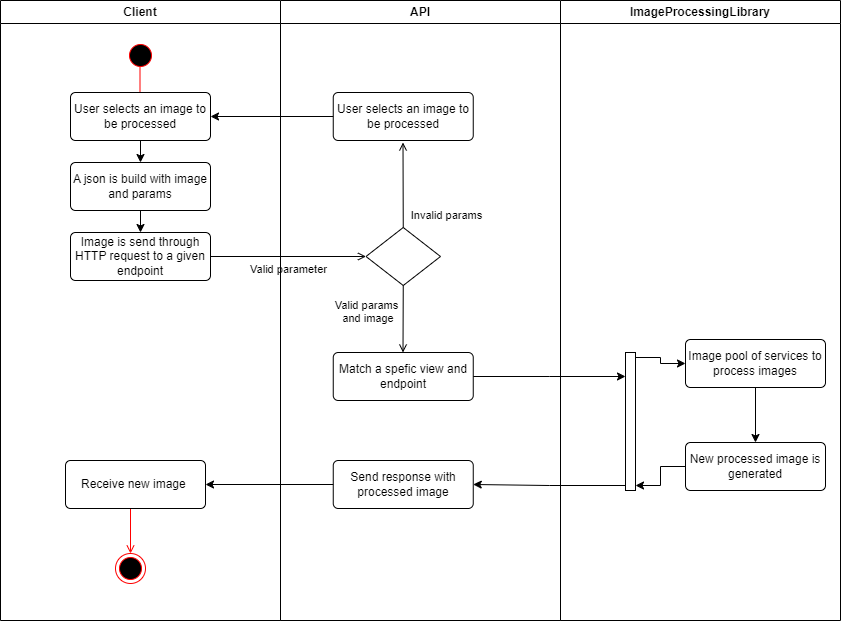

# Image Processing API

## Table of Content

- [Image Processing API](#image-processing-api)
  - [Table of Content](#table-of-content)
  - [About this project](#about-this-project)
  - [Design](#design)
  - [Use Cases](#use-cases)
  - [Requirements](#requirements)
  - [Out of Scope](#out-of-scope)
  - [Future Integrations and Features](#future-integrations-and-features)

## About this project

This project is a REST API that offers some of the most common image processing operations such as

- Color
- Brightness
- Contrast
- Sharpness

This API was designed to be implement for different applications that requires most common image processing

## Design

The following diagrams three main part of this API

- Client
- API
- Image processing library

I decided to separate the image processing functions and utilities into a separate library. The API django rest framework is responsible to response to a specific services, validate, and request specific functions required for image processing.

## Use Cases

Some of the main use cases for this API is to perform basic image processing operations such as:

- Gray scale
- Binary Image
- Restoration
- Image Enhancement
- Image translation
- RGBA
- Object detection (Future integration)

## Requirements

- Django
- Python
- Django Rest Framework

## Out of Scope

This API doesn't contemplate the following aspects

- Authentication such as JWT.
- Implementation of AI for specific image functions.
- Database storage (The response image and processed image is stored and deleted after being processed and sended through json response).
- Only one image can be processed at time (future implementation may process multiple images).

## Future Integrations and Features

Some future integration that this API may have is Object detection with AI, Object Description and specific AI utilities.
